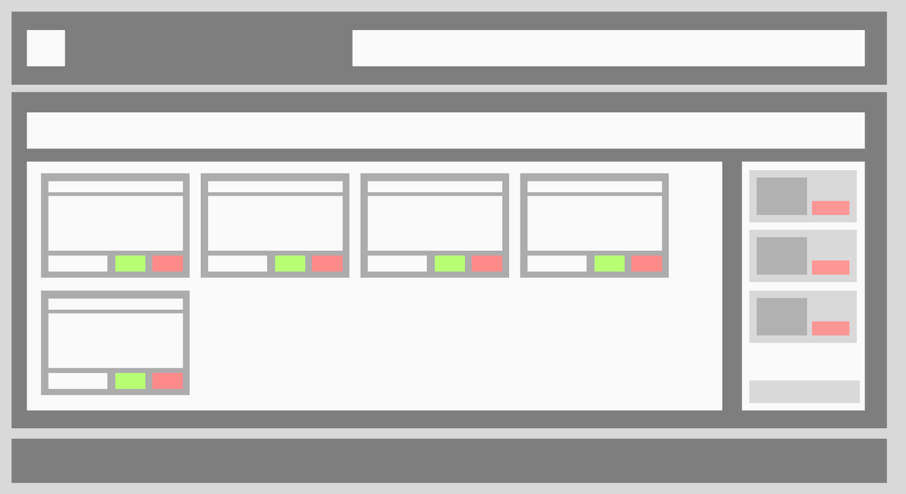
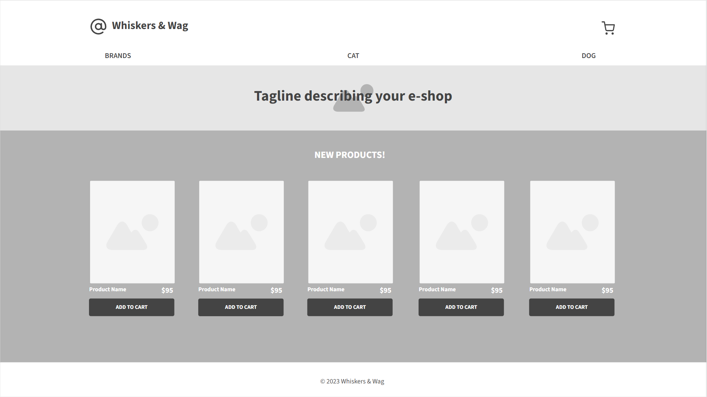
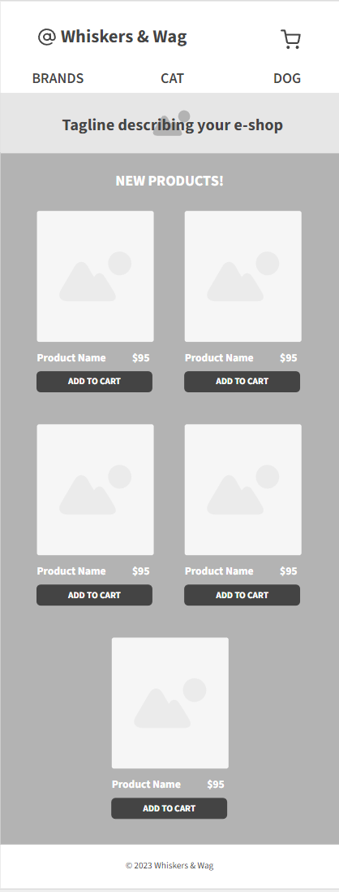
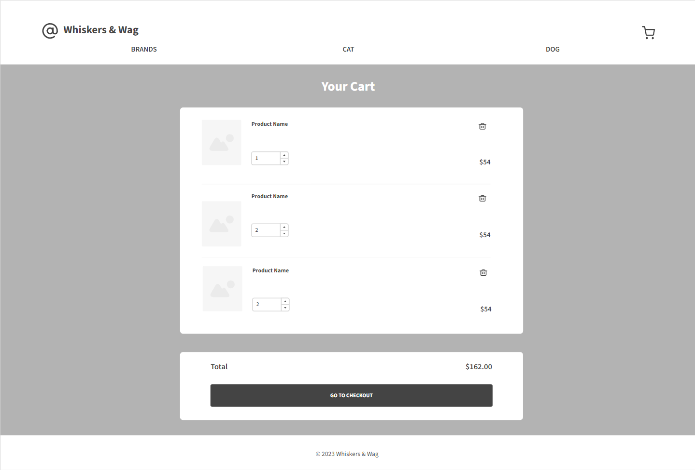
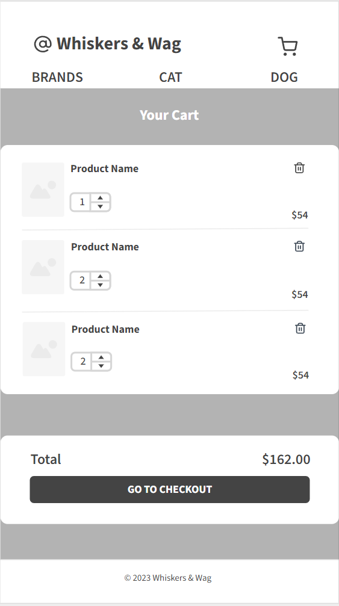

# Store Project (HTML & CSS)

## Description

This repository contains a JavaScript-based shopping cart project that demonstrates the implementation of a working shopping cart with key features such as dynamic rendering of products, add to cart functionality, and local storage integration.

## Authors

__Hugh Sinclair__
[GitHub](https://github.com/Hughsin23 "Hugh's GitHub") / [LinkedIn](https://www.linkedin.com/in/hugh-sinclair-dev/ "Hugh's LinkedIn") / <hughsin23@gmail.com>

__Kash Ghanchi__
[GitHub](https://github.com/kxxg1 "Kash's GitHub") / [LinkedIn](http://linkedin.com/in/kashg1/ "Kash's LinkedIn") / <kashgh9@gmail.com>

__Tracey Ngo__
[GitHub](https://github.com/NTracey "Tracey's GitHub") / [LinkedIn](https://www.linkedin.com/in/tracey-ngo/ "Tracey's LinkedIn") / <traceyngo4@gmail.com>

### Our instructor/mentor - __Elias Matta__

## Features

### Shopping Cart Functionality

* Implement a fully functional shopping cart.
* Users can add and remove items dynamically.
* Calculate and display the total price of items in the cart.

### Dynamic Rendering

* Dynamically render products and cart items to the DOM.
* Ensure seamless user experience with real-time updates.

### Local Storage Integration

* Persist cart items to local storage for data retention.
* Retrieve and render saved cart items on page load.

### API Integration

* Utilize an external API to display relevant information to users.
* Enhance user experience with dynamic content from the API.

### Date and Time Display

* Display the current date and time on the webpage.
* Enhance the user interface with real-time information.

## Our Store's Wireframe

### The store's initial wireframe

### More detailed wireframes for home page

#### Web's view

#### Mobile's view

### More detailed wireframes for shopping cart page

#### Web's view (Shopping Cart Page on Web's View)

#### Mobile's view (Shopping Cart Page on Mobile's View)

{: width="300" height="auto" }

## Trello Board

This screenshot showcases our project's Trello board, which we use to manage tasks, track progress, and collaborate in our web development project.

{: width="800" height="auto" }

## Tools & Resources

We used a variety of tools and resources to collaborate, such as:

* GitHub
* Slack
* Zoom
* Visual Studio Code
* Live Share (Visual Studio Code's extension)
